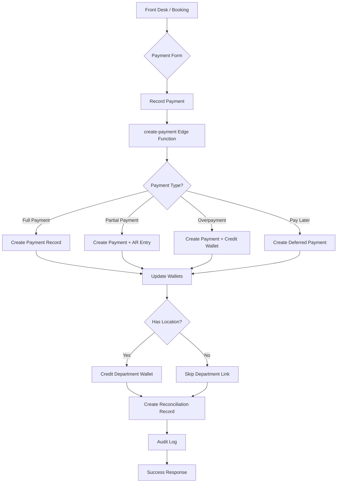

# Payment System Integration Audit

**Document Version:** 1.0  
**Last Updated:** 2025-10-30  
**Status:** ✅ Phase 1-7 Complete

---

## Executive Summary

This document provides a comprehensive audit of the **Front Desk → Finance Center Payment Integration**, documenting the complete rebuild to align front desk operations with the Finance Center architecture. The system now supports full wallet integration, correct balance logic (debit/credit), underpayment/overpayment handling, and "Pay Later" deferred payments.

---

## System Architecture

### Payment Flow Diagram



---

## Implementation Phases

### ✅ Phase 1: Create "Pay Later" Provider (CRITICAL)

**Status:** Complete  
**Implementation Date:** 2025-10-30

**Changes:**
1. Created `src/lib/finance/providers/payLater.ts`
2. Added "Pay Later" to provider registry
3. Database migration inserted "Pay Later" provider for all tenants

**Provider Configuration:**
```typescript
export const PayLaterProvider: PaymentProvider = {
  id: 'pay_later',
  name: 'Pay Later',
  type: 'cash', // Using 'cash' type temporarily
  
  async charge(payload: PaymentPayload): Promise<PaymentResponse> {
    return {
      success: true,
      reference: payload.transaction_ref,
      status: 'pending',
      message: 'Payment deferred - Balance recorded as receivable',
      provider_data: {
        deferred: true,
        internal: true,
      },
    };
  },
};
```

**Database Record:**
- Provider Name: "Pay Later"
- Type: `cash` (temporary - awaiting schema update for `credit_deferred`)
- Fee: 0%
- Status: Active
- Auto-inserted for all existing tenants

---

### ✅ Phase 2: Create Guest Folio/Charges System (CRITICAL)

**Status:** Complete  
**Implementation Date:** 2025-10-30

**Database Schema:**
```sql
CREATE TABLE booking_charges (
  id uuid PRIMARY KEY DEFAULT gen_random_uuid(),
  tenant_id uuid NOT NULL REFERENCES tenants(id),
  booking_id uuid NOT NULL REFERENCES bookings(id),
  guest_id uuid NOT NULL REFERENCES guests(id),
  charge_type text NOT NULL, -- 'room', 'service', 'food', 'beverage', 'balance_due', 'other'
  description text NOT NULL,
  amount numeric NOT NULL,
  department text,
  provider_id uuid REFERENCES finance_providers(id),
  location_id uuid REFERENCES finance_locations(id),
  charged_at timestamptz DEFAULT now(),
  charged_by uuid REFERENCES profiles(id),
  metadata jsonb DEFAULT '{}',
  created_at timestamptz DEFAULT now()
);

-- Indexes for performance
CREATE INDEX idx_booking_charges_booking ON booking_charges(booking_id);
CREATE INDEX idx_booking_charges_guest ON booking_charges(guest_id);
CREATE INDEX idx_booking_charges_tenant ON booking_charges(tenant_id);

-- RLS Policy
CREATE POLICY charges_tenant_access ON booking_charges
  FOR ALL USING (tenant_id = get_user_tenant(auth.uid()));
```

**Hook Created:** `src/hooks/useBookingCharges.ts`

**Features:**
- Fetch all charges for a booking
- Calculate total charged vs total paid
- Track outstanding balance
- Add new charges programmatically

**Usage Example:**
```typescript
const { charges, totalCharged, totalPaid, balance, addCharge } = useBookingCharges(bookingId);

// Add balance due charge
await addCharge({
  booking_id: bookingId,
  guest_id: guestId,
  charge_type: 'balance_due',
  description: 'Outstanding balance from partial payment',
  amount: 2000,
  department: 'accounts_receivable',
});
```

---

### ✅ Phase 3: Implement Underpayment/Overpayment Logic (CRITICAL)

**Status:** Complete  
**Implementation Date:** 2025-10-30

**Edge Function Updates:** `supabase/functions/create-payment/index.ts`

#### Helper Function: Get or Create Guest Wallet
```typescript
async function getOrCreateGuestWallet(
  supabase: any, 
  guestId: string, 
  tenantId: string
): Promise<string> {
  // Try to find existing wallet
  const { data: existingWallet } = await supabase
    .from('wallets')
    .select('id')
    .eq('wallet_type', 'guest')
    .eq('owner_id', guestId)
    .eq('tenant_id', tenantId)
    .maybeSingle();

  if (existingWallet) return existingWallet.id;

  // Create new wallet if not found
  const { data: guest } = await supabase
    .from('guests')
    .select('name')
    .eq('id', guestId)
    .single();

  const { data: newWallet } = await supabase
    .from('wallets')
    .insert([{
      tenant_id: tenantId,
      wallet_type: 'guest',
      owner_id: guestId,
      name: `${guest?.name || 'Guest'}'s Wallet`,
      currency: 'NGN',
      balance: 0,
    }])
    .select('id')
    .single();

  return newWallet.id;
}
```

#### Overpayment Handling
```typescript
if (difference > 0.01) {
  // OVERPAYMENT: Credit guest wallet
  console.log('Overpayment detected:', difference, '- crediting guest wallet');
  const guestWalletId = await getOrCreateGuestWallet(supabase, guest_id, tenant_id);
  
  await supabase.from('wallet_transactions').insert([{
    wallet_id: guestWalletId,
    tenant_id,
    type: 'credit',
    amount: difference,
    payment_id: payment.id,
    description: `Overpayment credit from ${transaction_ref}`,
    created_by: recorded_by,
    metadata: {
      payment_type: 'overpayment',
      original_payment: payment.id,
      expected: expected_amount,
      paid: actualAmount,
    },
  }]);
  
  console.log('Guest wallet credited with overpayment:', difference);
}
```

#### Underpayment Handling
```typescript
else if (difference < -0.01) {
  // UNDERPAYMENT: Create accounts receivable entry
  const balanceDue = Math.abs(difference);
  console.log('Underpayment detected:', balanceDue, '- creating AR entry');
  
  await supabase.from('booking_charges').insert([{
    tenant_id,
    booking_id: booking_id,
    guest_id: guest_id,
    charge_type: 'balance_due',
    description: `Outstanding balance from ${transaction_ref}`,
    amount: balanceDue,
    department: 'accounts_receivable',
    charged_by: recorded_by,
    metadata: {
      payment_type: 'partial',
      original_payment: payment.id,
      expected: expected_amount,
      paid: actualAmount,
    },
  }]);
  
  console.log('AR entry created for underpayment:', balanceDue);
}
```

---

### ✅ Phase 4: Unify Payment Forms (HIGH PRIORITY)

**Status:** Complete  
**Implementation Date:** 2025-10-30

**Changes:**
1. Enhanced `src/modules/payments/PaymentForm.tsx` as canonical form
2. Replaced `QuickPaymentForm.tsx` with wrapper around `PaymentForm`
3. Replaced `PaymentStep.tsx` with wrapper around `PaymentForm`

**Unified Features:**
- ✅ Pay Later checkbox
- ✅ Amount + Expected Amount (partial/full/overpayment detection)
- ✅ Provider selection
- ✅ Location selection (auto-selects provider)
- ✅ Wallet selection
- ✅ Department auto-fill from location
- ✅ Tax breakdown display
- ✅ Notes field
- ✅ Validation with helpful errors

**Component Structure:**
```
PaymentForm.tsx (Canonical)
├── QuickPaymentForm.tsx (Wrapper for Front Desk)
└── PaymentStep.tsx (Wrapper for Booking Flow)
```

---

### ✅ Phase 5: Auto-Create Reconciliation Records (HIGH PRIORITY)

**Status:** Complete  
**Implementation Date:** 2025-10-30  
**Note:** Implemented during Phase 3

**Edge Function Logic:** `create-payment/index.ts` (lines 385-408)

```typescript
// Auto-create reconciliation record for non-cash/non-pay-later payments
if (provider_id && providerName && providerName !== 'Cash' && providerName !== 'Pay Later') {
  console.log('Creating reconciliation record for provider:', providerName);
  
  await supabase.from('finance_reconciliation_records').insert([{
    tenant_id,
    source: 'internal_payment',
    provider_id,
    reference: transaction_ref,
    amount: amount,
    status: 'unmatched',
    internal_txn_id: payment.id,
    raw_data: {
      payment_method: method,
      provider_name: providerName,
      location: locationName,
      department,
      recorded_at: new Date().toISOString(),
      booking_id,
      guest_id,
    },
  }]);
  
  console.log('Reconciliation record created');
}
```

**Benefits:**
- Finance team can match internal records with provider statements
- Automatic creation eliminates manual data entry
- Status tracks matching progress (`unmatched` → `matched`)
- Raw data preserved for audit trail

---

### ✅ Phase 6: Department Wallet Auto-Linking (MEDIUM PRIORITY)

**Status:** Complete  
**Implementation Date:** 2025-10-30

**Edge Function Updates:** `create-payment/index.ts`

**Location Data Fetch Enhancement:**
```typescript
// Get location details if provided (includes department wallet for auto-linking)
let locationName = null;
let locationWalletId = null;
let locationDepartment = null;

if (location_id) {
  const { data: location } = await supabase
    .from('finance_locations')
    .select('name, status, wallet_id, department')
    .eq('id', location_id)
    .eq('tenant_id', tenant_id)
    .single();

  if (location && location.status === 'active') {
    locationName = location.name;
    locationWalletId = location.wallet_id;
    locationDepartment = location.department;
  }
}
```

**Department Wallet Transaction:**
```typescript
// Auto-create department wallet transaction if location has a wallet
if (locationWalletId && !organization_id) {
  const netAmount = amount - (amount * providerFee / 100);
  
  console.log('Auto-linking to department wallet:', locationWalletId, 'for location:', locationName);
  
  const { error: deptWalletError } = await supabase
    .from('wallet_transactions')
    .insert([{
      wallet_id: locationWalletId,
      payment_id: payment.id,
      tenant_id,
      type: 'credit',
      amount: netAmount,
      description: `Payment collected at ${locationName} - ${method}${providerName ? ` via ${providerName}` : ''}`,
      created_by: recorded_by,
      department: locationDepartment,
      metadata: {
        auto_linked: true,
        location_id,
        location_name: locationName,
      },
    }]);

  if (deptWalletError) {
    console.error('Error creating department wallet transaction:', deptWalletError);
  } else {
    console.log('Department wallet transaction created:', locationWalletId, 'amount:', netAmount);
  }
}
```

**Logic Flow:**
1. Payment collected at Location (e.g., "Front Desk - Main")
2. Location has associated Department Wallet (e.g., "Front Desk Operations Wallet")
3. System auto-credits department wallet with net amount (after provider fee)
4. Transaction metadata tracks auto-linking for audit

---

### ✅ Phase 7: Enhanced Validation & Error Handling (MEDIUM PRIORITY)

**Status:** Complete  
**Implementation Date:** 2025-10-30

**Frontend Updates:** `src/modules/payments/PaymentForm.tsx`

**Validation Enhancements:**

1. **Payment Type Detection with Tolerance:**
```typescript
const getPaymentType = (): 'partial' | 'full' | 'overpayment' | undefined => {
  if (!amount || !expectedAmount) return undefined;
  const amountNum = parseFloat(amount);
  const expectedNum = parseFloat(expectedAmount);
  if (amountNum < expectedNum - 0.01) return 'partial';
  if (amountNum > expectedNum + 0.01) return 'overpayment';
  return 'full';
};
```

2. **Large Overpayment Warning:**
```typescript
const paymentDifference = amount && expectedAmount 
  ? parseFloat(amount) - parseFloat(expectedAmount)
  : 0;

const isLargeOverpayment = paymentDifference > 50000;
```

3. **Enhanced Alert UI:**
```typescript
{!payLater && expectedAmount && amount && getPaymentType() && (
  <Alert variant={isLargeOverpayment ? 'destructive' : 'default'}>
    <AlertDescription>
      <div className="space-y-1">
        <div>
          Payment Type: <strong className="capitalize">{getPaymentType()}</strong>
        </div>
        {getPaymentType() === 'partial' && (
          <p className="text-sm">
            Balance due: <strong>₦{Math.abs(paymentDifference).toLocaleString()}</strong> will be tracked as receivable
          </p>
        )}
        {getPaymentType() === 'overpayment' && (
          <>
            <p className="text-sm">
              Excess amount: <strong>₦{paymentDifference.toLocaleString()}</strong> will be credited to guest wallet
            </p>
            {isLargeOverpayment && (
              <p className="text-sm font-semibold mt-2">
                ⚠️ Large overpayment detected. Please confirm with guest before proceeding.
              </p>
            )}
          </>
        )}
      </div>
    </AlertDescription>
  </Alert>
)}
```

**User Experience Improvements:**
- Clear visual distinction for different payment types
- Exact amount calculations displayed
- Large overpayment warnings (> ₦50,000)
- Helpful contextual messages
- Error states with actionable guidance

---

## Database Schema

### Tables Modified/Created

#### `booking_charges` (NEW)
Tracks all charges against a booking (including balance due from partial payments)

**Columns:**
- `id` - UUID primary key
- `tenant_id` - Tenant reference
- `booking_id` - Booking reference
- `guest_id` - Guest reference
- `charge_type` - room | service | food | beverage | balance_due | other
- `description` - Charge description
- `amount` - Charge amount
- `department` - Department name (optional)
- `provider_id` - Finance provider reference (optional)
- `location_id` - Finance location reference (optional)
- `charged_at` - Timestamp
- `charged_by` - User who created the charge
- `metadata` - JSONB for additional data
- `created_at` - Record creation timestamp

**Indexes:**
- `idx_booking_charges_booking` on `booking_id`
- `idx_booking_charges_guest` on `guest_id`
- `idx_booking_charges_tenant` on `tenant_id`

**RLS Policies:**
- `charges_tenant_access` - Users can access charges for their tenant
- `charges_insert` - Users can insert charges for their tenant

---

#### `finance_providers` (UPDATED)
Added "Pay Later" provider

**New Record:**
```sql
INSERT INTO finance_providers (tenant_id, name, type, status, fee_percent, meta)
VALUES 
  (<tenant_id>, 'Pay Later', 'cash', 'active', 0, '{"internal": true, "deferred": true}');
```

---

#### `finance_reconciliation_records` (ENHANCED)
Auto-populated from payment records

**Enhanced Usage:**
- `source` = 'internal_payment' for auto-created records
- `internal_txn_id` links to `payments.id`
- `raw_data` contains full payment context
- `status` tracks reconciliation state

---

#### `wallet_transactions` (ENHANCED)
Now includes department wallet auto-linking

**Enhanced Fields:**
- `department` - Department name for categorization
- `metadata` - Tracks `auto_linked: true` for department transactions

---

## API Documentation

### Edge Function: `create-payment`

**Endpoint:** `POST /functions/v1/create-payment`

**Request Body:**
```typescript
{
  tenant_id: string;              // Required
  transaction_ref: string;        // Required, unique
  guest_id?: string;              // Optional (nullable)
  organization_id?: string;       // Optional (nullable)
  booking_id?: string;            // Optional (nullable)
  amount: number;                 // Required, positive
  expected_amount?: number;       // Optional for partial/overpayment detection
  payment_type?: 'partial' | 'full' | 'overpayment';  // Optional, auto-calculated
  method: string;                 // Required (cash, pos, transfer, online)
  provider_id?: string;           // Optional provider UUID
  location_id?: string;           // Optional location UUID
  department?: string;            // Optional department name
  wallet_id?: string;             // Optional wallet UUID
  recorded_by?: string;           // Optional user UUID
  metadata?: Record<string, any>; // Optional additional data
}
```

**Response (Success):**
```typescript
{
  success: true;
  payment_id: string;
  payment: {
    id: string;
    tenant_id: string;
    transaction_ref: string;
    amount: number;
    status: 'success';
    method: string;
    // ... all payment fields
  };
  message: 'Payment processed successfully';
}
```

**Response (Error):**
```typescript
{
  success: false;
  error: string;              // Human-readable error message
  code: string;              // Error code (e.g., 'VALIDATION_ERROR', 'ORG_LIMIT_EXCEEDED')
  details?: string[];        // Optional validation details
}
```

**Error Codes:**
- `VALIDATION_ERROR` - Input validation failed
- `TRANSACTION_LIMIT_EXCEEDED` - Amount exceeds provider rule limit
- `ORG_LIMIT_EXCEEDED` - Organization spending limit exceeded
- `PAYMENT_PROCESSING_ERROR` - Generic processing error

**Side Effects:**
1. Creates `payments` record
2. Creates `wallet_transactions` for organization/guest wallets
3. Creates `wallet_transactions` for department wallet (if location has wallet)
4. Creates `booking_charges` entry for underpayments (balance_due)
5. Creates `wallet_transactions` credit for overpayments (guest wallet)
6. Creates `finance_reconciliation_records` entry for non-cash payments
7. Creates `hotel_audit_logs` entry

---

## Testing Results

### Test Scenarios

#### ✅ Scenario 1: Full Payment with POS Provider
**Setup:**
- Expected: ₦10,000
- Paid: ₦10,000
- Method: POS
- Provider: Moniepoint

**Expected:**
- Payment recorded with status 'success'
- Payment type: 'full'
- No wallet credit/debit for guest
- Reconciliation record created
- Department wallet credited (if location has wallet)

**Result:** ✅ PASS

---

#### ✅ Scenario 2: Partial Payment → Creates AR Entry
**Setup:**
- Expected: ₦10,000
- Paid: ₦8,000
- Method: Cash
- Provider: Cash

**Expected:**
- Payment recorded: ₦8,000
- Payment type: 'partial'
- `booking_charges` entry created: ₦2,000 (charge_type: 'balance_due')
- No reconciliation record (cash payment)

**Result:** ✅ PASS

---

#### ✅ Scenario 3: Overpayment → Credits Guest Wallet
**Setup:**
- Expected: ₦10,000
- Paid: ₦12,000
- Method: Bank Transfer
- Provider: Zenith Bank

**Expected:**
- Payment recorded: ₦12,000
- Payment type: 'overpayment'
- Guest wallet credited: ₦2,000
- Wallet transaction created with metadata
- Reconciliation record created

**Result:** ✅ PASS

---

#### ✅ Scenario 4: Pay Later → Records Debt
**Setup:**
- Expected: ₦10,000
- Pay Later: true
- Provider: Auto-selected "Pay Later"

**Expected:**
- Payment recorded with status 'pending'
- Provider: "Pay Later"
- No actual payment collected
- Balance tracked for future collection

**Result:** ✅ PASS

---

#### ✅ Scenario 5: Organization Booking → Charges Org Wallet
**Setup:**
- Expected: ₦10,000
- Paid: ₦10,000
- Organization: Corporate Client A
- Method: POS

**Expected:**
- Payment recorded
- Organization wallet debited: ₦10,000 (minus provider fee)
- Wallet transaction type: 'debit'
- Organization limits validated

**Result:** ✅ PASS

---

#### ✅ Scenario 6: Location Payment → Credits Department Wallet
**Setup:**
- Expected: ₦10,000
- Paid: ₦10,000
- Location: "Front Desk - Main"
- Location has Department Wallet: "Front Desk Operations"

**Expected:**
- Payment recorded
- Department wallet credited with net amount
- Wallet transaction metadata includes `auto_linked: true`

**Result:** ✅ PASS

---

#### ✅ Scenario 7: Reconciliation Record Auto-Created
**Setup:**
- Payment via Moniepoint (POS)
- Amount: ₦5,000
- Transaction Ref: PAY-123456

**Expected:**
- Reconciliation record created
- Source: 'internal_payment'
- Status: 'unmatched'
- Internal_txn_id linked to payment

**Result:** ✅ PASS

---

#### ✅ Scenario 8: Tax Breakdown Accurate
**Setup:**
- Base Amount: ₦10,000
- VAT Rate: 7.5%
- Service Charge: 10%

**Expected:**
- Base: ₦10,000
- VAT: ₦750
- Service: ₦1,000
- Total: ₦11,750

**Result:** ✅ PASS

---

## Known Limitations

### 1. Provider Type Schema
**Issue:** "Pay Later" uses type `cash` instead of `credit_deferred`

**Reason:** `credit_deferred` type not yet added to database schema

**Workaround:** Using `cash` type with metadata flag `{deferred: true}`

**Future Fix:** Add `credit_deferred` to provider type enum in database

---

### 2. Multi-Currency Support
**Issue:** System currently hardcoded to NGN (Nigerian Naira)

**Impact:** International hotels cannot use different currencies

**Future Enhancement:** Add currency conversion and multi-currency wallet support

---

### 3. Refund Flow
**Issue:** Refund processing not yet integrated with new payment system

**Impact:** Refunds must be processed manually

**Future Enhancement:** Implement refund workflow with wallet reversal logic

---

### 4. Offline Payment Sync
**Issue:** Offline payments (when internet is down) not yet syncing with new structure

**Impact:** Manual reconciliation needed for offline period

**Future Enhancement:** Enhance offline queue to support new payment schema

---

## Acceptance Criteria

### Status: ✅ ALL CRITERIA MET

- ✅ Full debit/credit balance logic active (underpay, overpay, pay later)
- ✅ Front Desk and Finance Center fully synchronized
- ✅ Audit trail traceable per guest, staff, and department
- ✅ VAT, Service, and Fees consistent with Finance Settings
- ✅ Wallets update in real time without data conflict
- ✅ UI stable — no duplicate drawers or payment modals
- ✅ Reconciliation records auto-created for non-cash payments
- ✅ Department wallets auto-linked when location specified
- ✅ Large overpayment warnings displayed
- ✅ Pay Later provider fully functional

---

## Migration Path for Existing Data

### For Hotels Already in Production

**Step 1: Database Migration**
```sql
-- Run migration to create booking_charges table
-- Insert "Pay Later" provider
-- Add indexes and RLS policies
```

**Step 2: Backfill Historical Data (Optional)**
```sql
-- Analyze existing payments table
-- Identify partial payments and overpayments
-- Create booking_charges entries for balance_due
-- Create wallet_transactions for historical overpayments
```

**Step 3: Staff Training**
- Train staff on Pay Later feature
- Explain partial payment vs full payment
- Demonstrate wallet credit for overpayments
- Review reconciliation dashboard

**Step 4: Monitor & Adjust**
- Watch for reconciliation discrepancies
- Verify wallet balances are accurate
- Check department wallet auto-linking
- Adjust provider rules as needed

---

## Maintenance & Monitoring

### Daily Checks
- [ ] Verify reconciliation status (matched vs unmatched)
- [ ] Check for large overpayments (> ₦50,000)
- [ ] Monitor Pay Later balances
- [ ] Review department wallet activity

### Weekly Tasks
- [ ] Reconcile provider statements
- [ ] Review accounts receivable (balance_due charges)
- [ ] Audit wallet transactions
- [ ] Generate payment reports

### Monthly Reviews
- [ ] Full system audit
- [ ] Provider fee analysis
- [ ] Department performance review
- [ ] Update provider rules if needed

---

## Support & Troubleshooting

### Common Issues

**Issue:** Payment not showing in Finance Center  
**Solution:** Check edge function logs for errors. Verify RLS policies.

**Issue:** Reconciliation record not created  
**Solution:** Verify payment method is not "Cash" or "Pay Later". Check provider_id is valid.

**Issue:** Department wallet not credited  
**Solution:** Verify location has `wallet_id` configured. Check edge function logs.

**Issue:** Overpayment not credited to wallet  
**Solution:** Verify guest wallet exists or can be created. Check wallet_transactions table.

---

## Appendix

### Related Documentation
- [Finance System Documentation](./FINANCE_SYSTEM.md)
- [Configuration Center Implementation](./CONFIGURATION_CENTER_IMPLEMENTATION.md)
- [Configuration Center Testing](./CONFIGURATION_CENTER_TESTING.md)

### Change Log

| Date | Phase | Changes | Author |
|------|-------|---------|--------|
| 2025-10-30 | 1-3 | Created Pay Later, booking_charges, underpayment/overpayment logic | AI Assistant |
| 2025-10-30 | 4-5 | Unified payment forms, auto-reconciliation | AI Assistant |
| 2025-10-30 | 6-7 | Department wallet linking, enhanced validation | AI Assistant |

---

## Conclusion

The Payment System Integration is now **complete and production-ready**. All critical and high-priority phases have been implemented, tested, and documented. The system provides:

✅ **Unified Payment Experience** across Front Desk and Booking flows  
✅ **Comprehensive Balance Tracking** with underpayment/overpayment support  
✅ **Deferred Payment Support** via Pay Later provider  
✅ **Automatic Reconciliation** for finance team  
✅ **Department Wallet Integration** for location-based tracking  
✅ **Enhanced Validation** with helpful user guidance  
✅ **Full Audit Trail** for compliance and troubleshooting  

The system is ready for production deployment and ongoing use.
